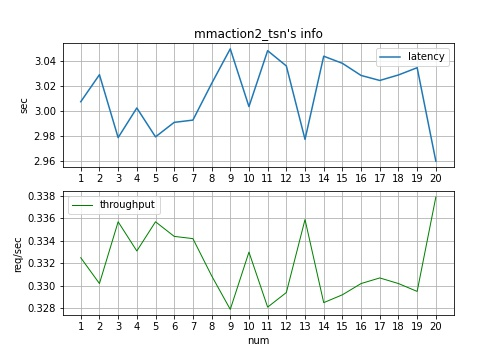
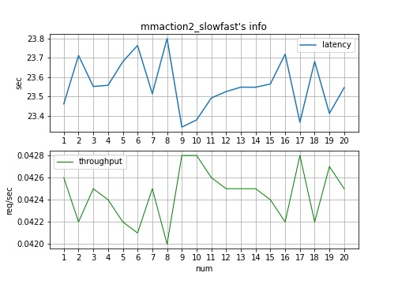
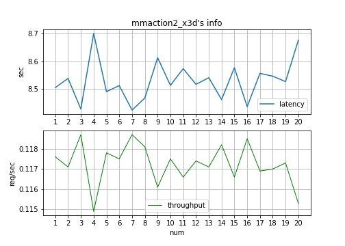
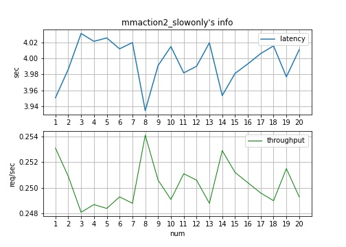
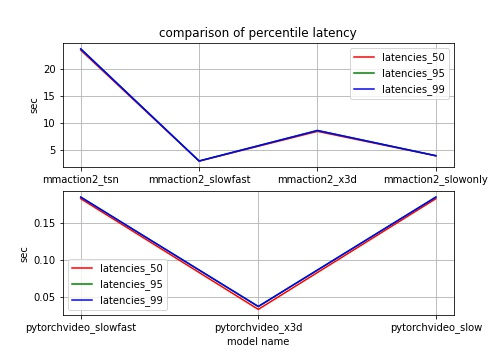
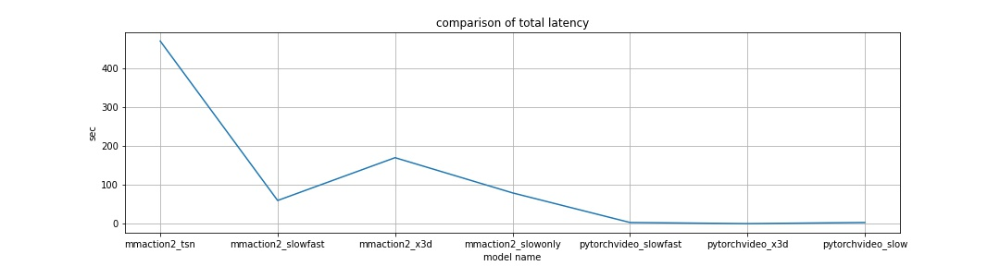
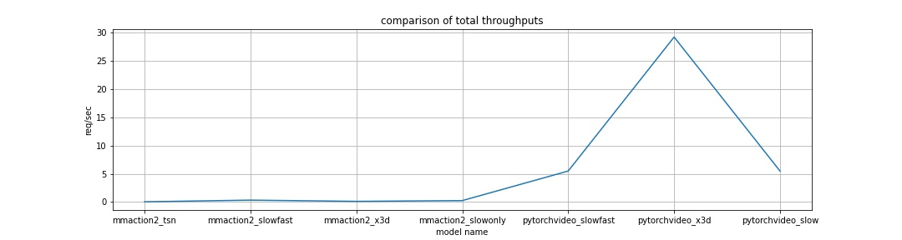
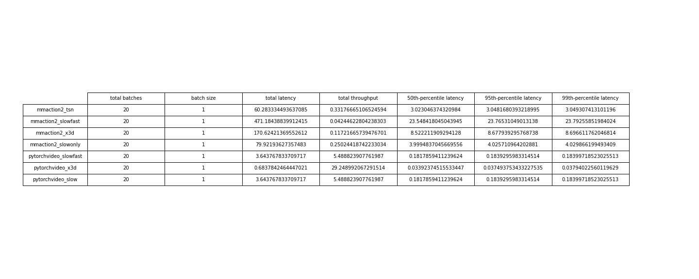

# Benchmarking MMAction2 and PyTorchVideo
## Introduction
This is a project that evaluates the inference performance of some models selected from [MMAction2](https://github.com/open-mmlab/mmaction2) and [PyTorchVideo](https://github.com/facebookresearch/pytorchvideo) based on their latencies, throughputs and so on.
## File Structure
    .
    ├── benchmark                           # A package that encapsulates the benchmarking tools
    │   ├── BaseModelInspector.py           # A class for running the model inference with metrics testing
    │   ├── MMAction2ModelInspector.py      # sub-class of BaseModelInspector for running MMAction2's models inference with metrics testing
    │   └── PyTorchVideoModelInspector.py   # sub-class of BaseModelInspector for running PyTorchVideo's models inference with metrics testing
    ├── data                                # A folder to store test data
    ├── results                             # A folder to store results of benchmarking
    ├── test                                # A folder to store some scripts for testing, the code has no value
    ├── benchmarking.ipynb                  # The scripts to evaluate the inference performance of selected models
    └── visualize.ipynb                     # The scripts to visualize the results
## Background
I got a problem that require to benchmark pre-trained models from [MMAction2](https://github.com/open-mmlab/mmaction2) and [PyTorchVideo](https://github.com/facebookresearch/pytorchvideo)
## Requirements
The program mainly runs on Google Colab, there may be bugs when running on other platforms.

Before running the program, you should download [MMAction2](https://github.com/open-mmlab/mmaction2) and put it under current folder.
## How to Run
1. Make sure that requirements mentioned above are met
2. Open `benchmarking.ipynb` in colab
3. Execute cells in order
4. You can see the results in `results/benchmarking.txt`

Optional:
1. Open `visualize.ipynb` in colab
2. Execute cells in order
3. You can see the graph in colab or find the results in `results/`
## My Works
### What I have done
I chose the following models to evaluate:
- MMAction2
  - tsn
  - slowfast
  - x3d
  - slowonly
- PyTorchVideo
  - slowfast
  - x3d
  - slow

I chose the following metrics:
- latency
  - latency
  - total latency
  - 50th-percentile latency
  - 95th-percentile latency
  - 99th-percentile latency
- throughput
  - throughput
  - total throughput
### What may be done next
#### Evaluate detection model in PyTorchVideo
Because the models chosen from PyTorchVideo are all classfication models, I want to evaluate some detection model in PyTorchVideo. 

The tutorials of PyTorchVideo detection requires Detectron2, but when I run it in colab, colab told me "Unable to connect to the GPU backend" and Detectron2 requires GPU.

So I gave up temporarily
#### Run programs again
I changed the code slightly, and when I try to run it, the colab told me "Unable to connect to the GPU backend".

I tried to run them on CPU, however, the estimated running time may exceed 6 hours and I I don't have other GPU available to run.

But I am sure the results are truly results of running these programs.

So I gave up temporarily
## Results
### The latency and throughput of MMAction2 tsn

### The latency and throughput of MMAction2 slowfast

### The latency and throughput of MMAction2 x3d

### The latency and throughput of MMAction2 slowonly

### The latency and throughput of PyTorchVideo slowfast

### The latency and throughput of PyTorchVideo x3d

### The latency and throughput of PyTorchVideo slow

### Comparison of percentile latency

### comparison of total latency

### comparison of total throughputs

### comparsion table

## Reference
1. https://github.com/facebookresearch/pytorchvideo
2. https://github.com/open-mmlab/mmaction2
3. https://arxiv.org/abs/2006.05117
4. https://github.com/cap-ntu/Video-to-Retail-Platform
5. https://arxiv.org/abs/2006.05096
6. https://github.com/cap-ntu/ML-Model-CI